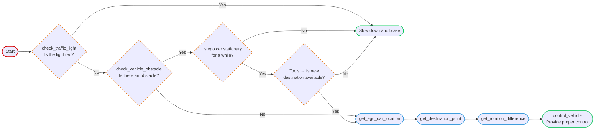

# Carla with LLM Agent

## Introduction

### Control logic

The high-level control for the agent is shown below:



## Setup

### Dependencies

We maintain our dependencies with `uv`. Please ensure you have it installed. To setup the project, run the following command:
```shell
uv sync
```

### Data

We use the documents from Carla as our database, please download with:
```shell
# Default version is 0.9.15
bash script/download_doc.sh

# If you want to specify a different version, run:
bash script/download_doc.sh 0.10.0
```

### API Key

Please setup the API key from [OpenAI](https://platform.openai.com/settings/organization/api-keys) and place it in `./.env` by:

```text
OPENAI_API_KEY={KEY_HERE}
```

## Usage

```shell
# Default to GPT-4o-mini. 
python chat_agent

# Specify `--model_type` to choose from different models.
python chat_agent.py --model_type gpt-4o
```