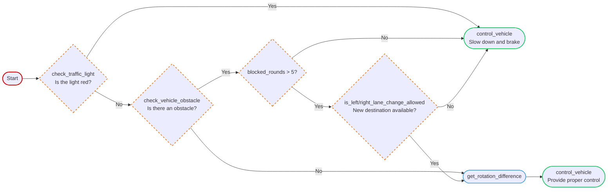

# Carla with LLM Agent

## Introduction

Drive a vehicle in the [CARLA](https://carla.org/) simulator with an **LLM agent** instead of a hand-written controller. At a fixed interval the agent is handed the ego car's situation and a set of tools, and it decides how to act. What it does:

- **Obeys traffic lights** — slows down and brakes when the light ahead is red.
- **Avoids obstacles** — detects vehicles blocking the way and stops behind them.
- **Follows a planned route** — a global route planner lays out the path, and the agent steers/throttles to reach the destination.
- **Reroutes when stuck** — picks a new destination when the ego car stays blocked for too long.
- **Reasons about lane changes** — checks whether a left or right lane change is allowed before committing.
- **Grounded in CARLA docs** — the simulator's documentation is indexed into a vector database for the agent to reference.

### Demo

| Stable driving | Turning left |
| :---: | :---: |
|  |  |

### Control logic

The high-level control for the agent is shown below:



## Setup

### Dependencies

We maintain our dependencies with `uv`. Please ensure you have it installed. To setup the project, run the following command:
```shell
uv sync
```

### Data

We use the documents from Carla as our database, please download with:
```shell
# Default version is 0.9.15
bash script/download_doc.sh

# If you want to specify a different version, run:
bash script/download_doc.sh 0.10.0
```

### API Key

Please setup the API key from [OpenAI](https://platform.openai.com/settings/organization/api-keys) and place it in `./.env` by:

```text
OPENAI_API_KEY={KEY_HERE}
```

## Usage

```shell
# Default to GPT-4o-mini. 
python chat_agent

# Specify `--model_type` to choose from different models.
python chat_agent.py --model_type gpt-4o
```